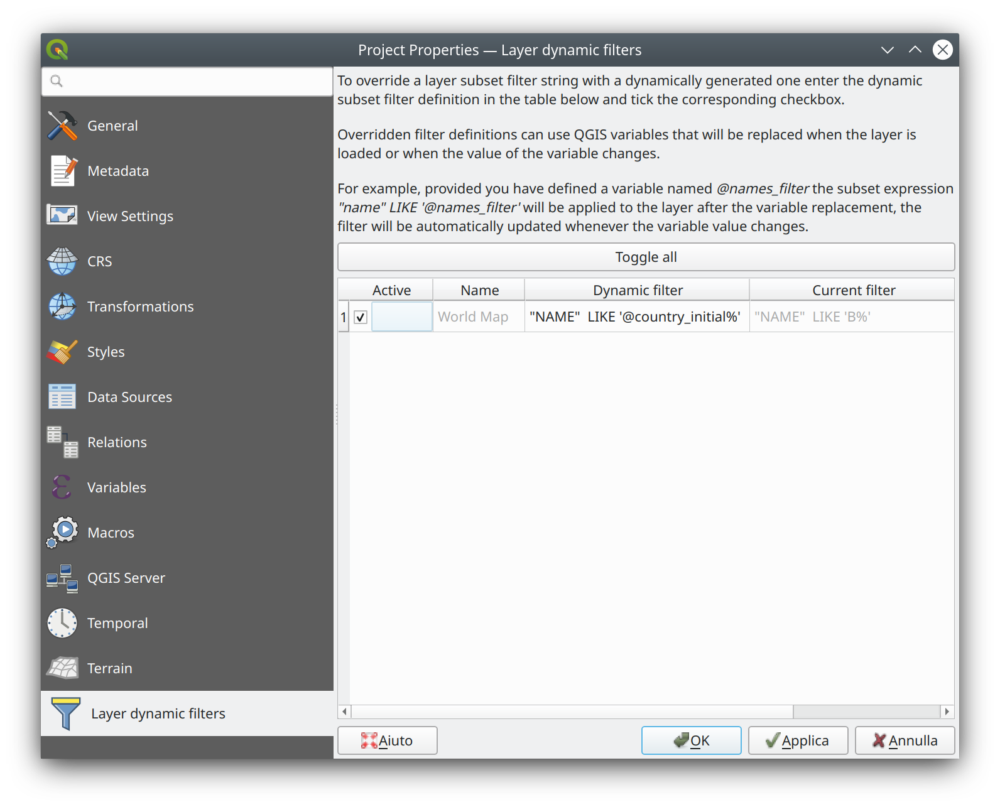

# Dynamic subset filter plugin

QGIS plugin to dynamically set provider filters using QGIS variable replacement.

The plugin adds a new tab to the Project Properties dialog where the dynamic filters
can be set and enabled for each individual layer.

The subset filter is updated whenever a variable referenced in the filter is changed.

